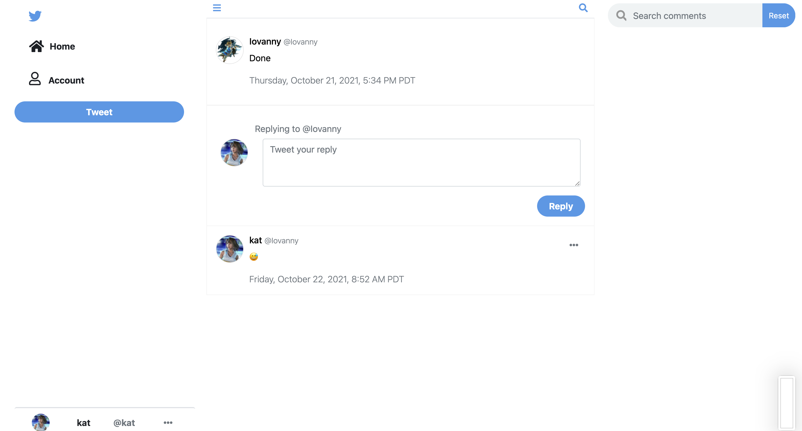

# Twitter Clone Reverse Engineer
> A reverse engineer of the popular social media application Twitter. Using Node.js, MongoDB, Express, EJS, and SASS, the clone works in conjunction to allow features such as user account creation and editing, tweeting, and commenting.
> Live demo [_here_](https://twitter-reverse-engineer.herokuapp.com/). 

## Table of Contents
* [Technologies Used](#technologies-used)
* [Features](#features)
* [Screenshots](#screenshots)
* [Planning](#planning)
* [User Stories](#user-stories)
* [Project Status](#project-status)
* [Room for Improvement](#room-for-improvement)
* [Acknowledgements](#acknowledgements)

## Technologies Used
- Bootstrap
- Node.js
- MongoDB
- Express
- Ejs

## Features
Current ready features:
- User Account Creation
- User Account Editing and Deletion
- Posting Tweets
- Replying to Tweets with Comments
- Searching Tweets and Comments
- Toggling layout and theme of dashboard

## Screenshots

## Planning

## User Stories

## Project Status
Project is: _complete_ 

## Room for Improvement

Room for improvement:
- Mobile Responsive
- Theme Improvement

## Acknowledgements
- This project was based on [twitter](https://www.twitter.com).

